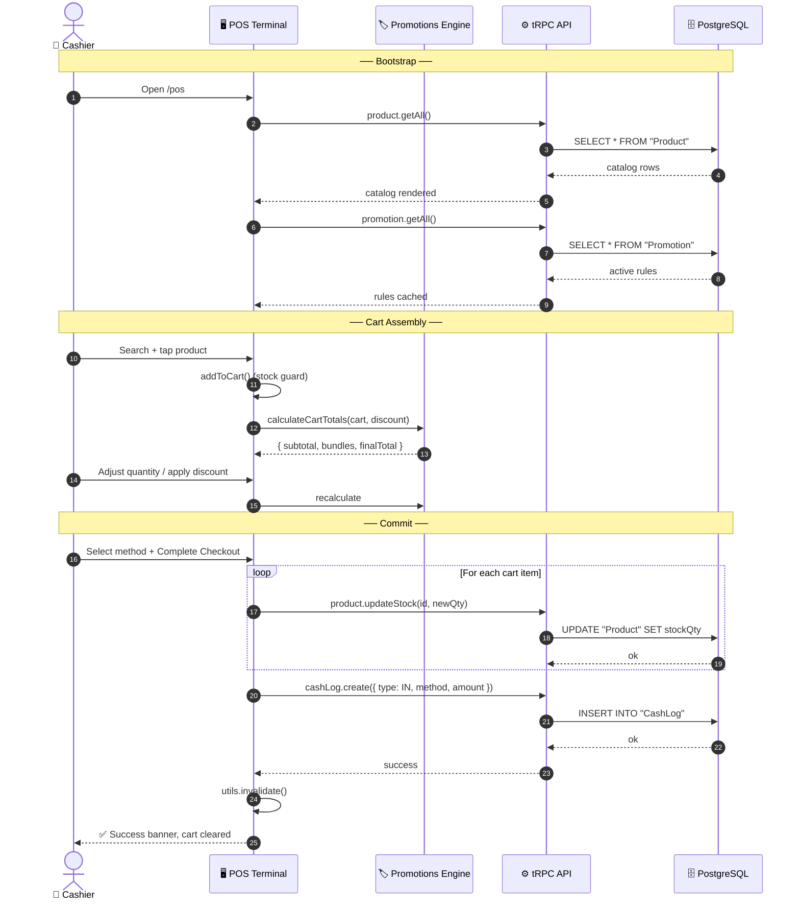
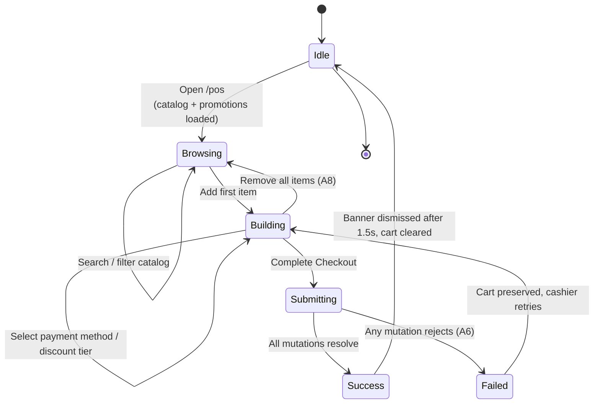

<div align="center">

# 🛒 Complete a POS Sale

### The primary revenue path of **APEX_OS**

*An end-to-end specification of how a cashier converts a customer's basket into a committed transaction: decrementing inventory, applying promotions, recording ledger entries, and emitting analytics telemetry.*

<br />


-06b6d4?style=for-the-badge&labelColor=090D16)


</div>

> **Module:** POS Terminal (`/pos`) · **Primary Actor:** Cashier / Operator · **Trigger:** Customer presents items for purchase at the register
> **Related Modules:** Inventory · Promotions · Cash Drawer · Analytics

---

## 📖 Contents

1. [Executive Summary](#1--executive-summary)
2. [Actors & Roles](#2--actors--roles)
3. [Preconditions](#3--preconditions)
4. [Main Success Scenario](#4--main-success-scenario)
5. [Postconditions](#5--postconditions)
6. [Exception & Alternative Flows](#6--exception--alternative-flows)
7. [Sequence Diagram](#7--sequence-diagram)
8. [State Machine](#8--state-machine)
9. [Business Rules](#9--business-rules)
10. [Promotion Engine Spec](#10--promotion-engine-spec)
11. [Data Contract](#11--data-contract)
12. [UI Reference](#12--ui-reference)
13. [Security & Authorization](#13--security--authorization)
14. [Telemetry & Observability](#14--telemetry--observability)
15. [Test Scenarios](#15--test-scenarios)
16. [Success Metrics](#16--success-metrics)

---

## 1 · Executive Summary

> The **Complete a POS Sale** use case is the beating heart of APEX_OS. Every other module (Inventory, Promotions, Cash Drawer, Analytics) exists to support, observe, or react to this one flow.

A cashier opens the **POS Terminal** at `/pos`, assembles a cart from the live product catalog, watches the system apply active promotion bundles in real time, chooses a payment method, and commits the sale. The system then:

- **Decrements** `Product.stockQty` for every purchased SKU
- **Records** a `CashLog` entry routed to either the physical drawer or the card ledger
- **Emits** a telemetry event for the operations stream
- **Invalidates** cached queries so every other screen reflects the new state

The flow targets a **sub-45-second median checkout time** while preserving strict inventory accuracy and auditability.

### 🔑 Key Characteristics

| ⚡ Real-time | 🔒 Authenticated | 📊 Observable | 🧮 Deterministic |
|:---:|:---:|:---:|:---:|
| Promotions and totals recompute on every cart change | Every sale is bound to a JWT session | Full telemetry trail for every step | Pure-function cart math, no hidden state |

---

## 2 · Actors & Roles

| Actor | Type | Responsibility |
|---|---|---|
| 👤 **Cashier** | Primary | Operates the register: searches the catalog, adds items, applies discounts, selects the payment method, and commits the sale. |
| ⚙️ **System** | Supporting | Validates stock in real time, evaluates promotion bundles, computes totals, executes mutations, and records telemetry. |
| 📦 **Inventory Engine** | Supporting | Provides the live product catalog and accepts stock decrement mutations. |
| 🏷️ **Promotions Engine** | Supporting | Supplies active bundle rules and drives client-side discount evaluation. |
| 💰 **Cash Drawer** | Supporting | Receives the committed ledger entry, routed by payment method. |
| 🛡️ **Manager** | *Future* | Will authorize manual discounts above the cashier's allowed threshold. |

---

## 3 · Preconditions

| ✓ | Invariant | Verification |
|:---:|---|---|
| ✅ | **Authenticated session** | Valid JWT via NextAuth v5; the operator's `user.id` is available in session context. |
| ✅ | **POS Terminal reachable** | Route `/pos` renders successfully and the tRPC client is connected. |
| ✅ | **Non-empty catalog** | At least one `Product` exists with `stockQty > 0`. |
| ✅ | **Promotions loaded** *(optional)* | If any `Promotion` rows exist with `isActive = true`, they are fetched alongside the catalog. |
| ✅ | **Payment method available** | The cash drawer is unlocked *or* the card terminal is online. |

---

## 4 · Main Success Scenario

| # | Actor | Action |
|:---:|---|---|
| **1** | Cashier | Opens the POS Terminal at `/pos`. |
| **2** | System | Loads the live product catalog via `product.getAll` and active bundles via `promotion.getAll`. |
| **3** | Cashier | Types a query into the search bar, matching by **name** or **SKU**. |
| **4** | System | Filters the product grid in real time (case-insensitive substring match). |
| **5** | Cashier | Taps a product card to add it to the active cart. |
| **6** | System | Validates `stockQty > 0` and appends the item (or increments quantity if already present). |
| **7** | Cashier | Adjusts quantities with the `+` / `−` stepper controls. |
| **8** | System | Blocks any increment that would push quantity past the live `stockQty`. |
| **9** | System | Re-evaluates all active promotion bundles on every cart mutation. |
| **10** | System | Displays per-bundle savings lines and recalculates the grand total live. |
| **11** | Cashier | *(Optional)* Applies a manual discount tier: `0%` · `5%` · `10%` · `15%`. |
| **12** | Cashier | Selects a payment method: **CASH** or **CARD**. |
| **13** | Cashier | Clicks **Complete Checkout**. |
| **14** | System | Decrements `stockQty` for every line item via `product.updateStock`. |
| **15** | System | Writes a `CashLog` entry with `type = "IN"` and the selected method. |
| **16** | System | Invalidates cached queries, clears the cart, and shows the success banner. |
| **17** | System | Emits telemetry events across the full transaction lifecycle. |

> **🎬 Outcome:** The sale is committed. Inventory is reduced. The cash/card ledger is updated. The register is idle and ready for the next customer.

---

## 5 · Postconditions

| | State Change | Detail |
|:---:|---|---|
| 📦 | **Inventory decremented** | Every purchased SKU has `stockQty_new = max(0, stockQty_old − qty_sold)`. |
| 💰 | **Ledger entry written** | A new `CashLog` row exists with `type = "IN"`, `method = CASH \| CARD`, `amount = finalTotal`, `reason = "POS Sale via <METHOD> (<n> items)"`, `userId = <operator>`. |
| 🛒 | **Cart reset** | Active cart is empty; totals show `R0.00`; discount resets to `0%`. |
| 🔄 | **Cache invalidated** | `product.getAll` and `cashLog.*` queries are refetched globally. |
| 📡 | **Telemetry emitted** | Events pushed with types `API`, `SYS`, `CLICK` throughout the flow. |

---

## 6 · Exception & Alternative Flows

| Code | Condition | System Response |
|:---:|---|---|
| `A1` | Product is out of stock | Card renders in a **disabled state** (`opacity-50`, rose badge); tap is a no-op. |
| `A2` | Quantity increment exceeds stock | Counter **silently refuses**; quantity stays at its current value. |
| `A3` | No promotion matches the cart | No bundle savings line rendered; only the manual discount (if any) applies. |
| `A4` | Multiple bundles match | Each rule is evaluated **independently and stacked**; savings sum. |
| `A5` | Checkout with empty cart | Checkout button is **disabled**; no network call dispatched. |
| `A6` | Backend mutation fails mid-checkout | UI shows `ERROR: TRANSACTION ABORTED`; cart preserved for retry. ⚠️ *Stock/cash mutations are **not** rolled back. See [§13](#13--security--authorization).* |
| `A7` | Manual discount above threshold *(future)* | Will require a **manager PIN** before applying. |
| `A8` | Cashier removes all line items | Cart returns to empty state; totals reset; discount tier preserved. |

---

## 7 · Sequence Diagram



---

## 8 · State Machine



| State | Description | Checkout Enabled |
|---|---|:---:|
| **Idle** | Terminal is ready; no active session data. | ❌ |
| **Browsing** | Catalog is loaded; cart is empty. | ❌ |
| **Building** | Cart has at least one line item; totals are live. | ✅ |
| **Submitting** | Mutations in flight; controls are locked. | ❌ |
| **Success** | Sale committed; banner shown. | ❌ |
| **Failed** | Error shown; cart retained for retry. | ✅ |

---

## 9 · Business Rules

| Rule | Specification |
|:---:|---|
| **BR-01** | A product with `stockQty ≤ 0` **cannot** be added to the cart; the card is disabled at render time. |
| **BR-02** | Cart quantity for any SKU **cannot exceed** its live `stockQty`. |
| **BR-03** | A promotion triggers when the aggregate matching quantity **meets or exceeds** `requiredQty`. |
| **BR-04** | Promotion matching is a **case-insensitive substring** against both `sku` and `name`. |
| **BR-05** | Bundle savings = `(baselineUnitPrice × requiredQty × bundleCount) − (bundlePrice × bundleCount)`. |
| **BR-06** | Manual discounts are restricted to the tiers `0% · 5% · 10% · 15%`. |
| **BR-07** | Currency is **South African Rand (R)**; no sales tax is applied at the register. |
| **BR-08** | Every successful sale **must** produce exactly **one** `CashLog` entry. |
| **BR-09** | Stock decrements occur **before** the ledger write; any failure surfaces to the operator. |
| **BR-10** | Promotion rules never produce a **negative cart subtotal**; final total is clamped to `≥ 0`. |

---

## 10 · Promotion Engine Spec

The cart math is a pure function (`calculateCartTotals`) that returns a deterministic breakdown:

```ts
function calculateCartTotals(cart, discountPercent, activeBundleRules) {
  // 1. Raw subtotal
  subtotal = Σ (item.price × item.quantity)

  // 2. Bundle evaluation (per rule, independent)
  for each rule in activeBundleRules:
      matching = cart.filter(i =>
          i.sku.toLowerCase().includes(rule.targetSkuPattern) ||
          i.name.toLowerCase().includes(rule.targetSkuPattern))
      qty = Σ matching.quantity
      if qty >= rule.requiredQty:
          bundleCount   = floor(qty / rule.requiredQty)
          baselinePrice = matching[0].price
          savings       = (bundleCount × rule.requiredQty × baselinePrice)
                        − (bundleCount × rule.bundlePrice)
          if savings > 0: totalBundleSavings += savings

  // 3. Percentage discount (post-bundle)
  adjustedSubtotal = max(0, subtotal − totalBundleSavings)
  discountAmount   = adjustedSubtotal × (discountPercent / 100)
  finalTotal       = max(0, adjustedSubtotal − discountAmount)

  return { subtotal, totalBundleSavings, adjustedSubtotal, discountAmount, finalTotal }
}
```

### Worked Example

| Item | SKU | Unit Price | Qty | Line Total |
|---|---|---:|:---:|---:|
| Hydro Gummies 20mg | `HYD-GUM-20` | R120.00 | 3 | R360.00 |
| Sparkling Water | `DRK-SPK-01` | R25.00 | 2 | R50.00 |

**Active rule:** `requiredQty = 2`, `targetSkuPattern = "gum"`, `bundlePrice = R200.00`

| Step | Calculation | Amount |
|---|---|---:|
| Subtotal | R360 + R50 | R410.00 |
| Matching qty | 3 × `HYD-GUM-20` | 3 |
| Bundle count | `floor(3 / 2)` | 1 |
| Bundle savings | `(1 × 2 × R120) − (1 × R200)` | −R40.00 |
| Adjusted subtotal | R410 − R40 | R370.00 |
| Manual discount (10%) | R370 × 0.10 | −R37.00 |
| **Final Total** | | **🟢 R333.00** |

---

## 11 · Data Contract

### Entities Read

| Entity | Fields | Purpose |
|---|---|---|
| `Product` | `id`, `name`, `sku`, `price`, `stockQty` | Catalog + stock guard |
| `Promotion` | `id`, `name`, `targetSkuPattern`, `requiredQty`, `bundlePrice` | Bundle evaluation |
| `Session` | `user.id`, `user.name` | Ledger attribution |

### Entities Written

**`Product` · `UPDATE`**

```ts
{
  id: string,
  stockQty: number   // old − qty, clamped at 0
}
```

**`CashLog` · `INSERT`**

```ts
{
  type: "IN",
  method: "CASH" | "CARD",
  amount: number,
  reason: `POS Sale via ${method} (${cart.length} items)`,
  userId: session.user.id
}
```

### tRPC Procedures Involved

| Procedure | Type | Role in Flow |
|---|---|---|
| `product.getAll` | `publicProcedure` | Hydrate catalog |
| `promotion.getAll` | `publicProcedure` | Hydrate bundles |
| `product.updateStock` | `publicProcedure` | Decrement per line item |
| `cashLog.create` | `protectedProcedure` | Write ledger entry |

---

## 12 · UI Reference

```text
┌───────────────────────────────────────────────────────────────────────┐
│  ⌨️  POS Terminal                     [● LIVE SYNC]   [⏱ 14ms] [🛡️]  │
├──────────────────────────────────┬────────────────────────────────────┤
│  🔍 Search catalog by name/SKU   │  🛒 ACTIVE CART LEDGER    [3 ITEMS]│
│  ┌────────────────────────────┐  │  ──────────────────────────────────│
│  │                            │  │  Hydro Gummies     R120.00 ×3  🗑  │
│  ├────────┬────────┬──────────┤  │  Sparkling Water   R25.00  ×2  🗑  │
│  │ Hydro  │ Spark. │  Chip    │  │  ──────────────────────────────────│
│  │ Gum-20 │ Water  │  BBQ     │  │  Payment:  [💵 CASH] [💳 CARD]    │
│  │ R120   │ R25    │  R18     │  │  Discount: [0%] [5%] [10%] [15%]  │
│  │ 24 left│ 12 left│  0 OUT   │  │  ──────────────────────────────────│
│  ├────────┼────────┼──────────┤  │  Subtotal              R410.00    │
│  │ ...    │ ...    │   ...    │  │  Bundle: Gummies (×1)   −R40.00   │
│  │        │        │          │  │  Rebate (10%)           −R37.00   │
│  └────────┴────────┴──────────┘  │  ──────────────────────────────────│
│                                  │  TOTAL                 R333.00    │
│                                  │  ┌─────────────────────────────┐  │
│                                  │  │  ✅ COMPLETE CHECKOUT       │  │
│                                  │  └─────────────────────────────┘  │
└──────────────────────────────────┴────────────────────────────────────┘
```

**Key UI affordances:**

- Out-of-stock cards render in a muted disabled state with a rose **"OUT OF STOCK"** badge
- Bundle savings render per rule in emerald green
- The manual discount tier selector is sticky above the total
- The success banner auto-dismisses after 1.5 seconds and clears the cart

---

## 13 · Security & Authorization

| Concern | Current State | Recommended Hardening |
|---|---|---|
| **Authentication** | NextAuth v5 credentials + bcrypt + JWT ✅ | None; solid. |
| **Ledger write** | `protectedProcedure` ✅ | None. |
| **Stock mutation** | `publicProcedure` ⚠️ | Promote to `protectedProcedure`; currently any caller can zero out stock. |
| **Catalog read** | `publicProcedure` ⚠️ | Fine for public storefronts; restrict if the catalog is sensitive. |
| **Checkout atomicity** | Sequential mutations, **no transaction** ⚠️ | Wrap in `db.$transaction([...])` inside a single `sale.create` procedure. |
| **Route protection** | Middleware covers `/pos`, `/cash`, `/products` | Extend matcher to `/inventory`, `/analytics`, `/database`, `/manager/*`. |

> [!WARNING]
> The current checkout flow loops over items and calls `updateStock` per item, then writes the ledger. If any intermediate step fails, the transaction is partially applied with **no rollback**. The recommended fix is to move the entire operation into a single `db.$transaction` block behind a dedicated `sale.create` procedure.

---

## 14 · Telemetry & Observability

Every meaningful step emits a structured telemetry event via `pushTelemetry(type, message)`, persisted to `sessionStorage` and broadcast to the live Command Center stream.

| Event | Type | Message Pattern |
|---|:---:|---|
| Add to cart | `CLICK` | `Added asset node [SKU: HYD-GUM-20] - Hydro Gummies to active register cart` |
| Remove from cart | `CLICK` | `Removed asset [SKU: ...] from active register cart` |
| Payment method | `CLICK` | `Selected payment vector: CARD` |
| Discount tier | `CLICK` | `Applied discount rebate tier: 10%` |
| Checkout initiated | `API` | `Initiating secure POS checkout transaction via CARD... Total: R333.00` |
| Sale committed | `SYS` | `Transaction successfully signed & recorded. Inventory nodes decremented.` |
| Sale failed | `SYS` | `CRITICAL: POS transaction sequence interrupted. Ledger rolled back.` |

**Observable dashboards:**

- 🖥️ `/`: Live Neural Telemetry feed with filter chips and sort toggle
- 📊 `/analytics`: Hourly throughput, low-stock alerts, top SKUs
- 💰 `/cash`: Full ledger with cash/card tabbed history

---

## 15 · Test Scenarios

<details>
<summary><b>TC-01 · Happy Path: Single Item, Cash</b></summary>

- **Given** a product Hydro Gummies exists with `stockQty = 10`
- **When** the cashier adds 1 unit, selects CASH, and completes checkout
- **Then** stock becomes 9 and a `CashLog` row exists with `type=IN`, `method=CASH`, `amount=R120.00`

</details>

<details>
<summary><b>TC-02 · Stock Guard: Quantity Ceiling</b></summary>

- **Given** a product with `stockQty = 2`
- **When** the cashier adds it and taps `+` three times
- **Then** the quantity stays at 2, no overflow

</details>

<details>
<summary><b>TC-03 · Out-of-Stock Item is Disabled</b></summary>

- **Given** a product with `stockQty = 0`
- **When** the catalog renders
- **Then** the card has `opacity-50`, a rose badge, and is not clickable

</details>

<details>
<summary><b>TC-04 · Bundle Savings Applied</b></summary>

- **Given** a rule `{ targetSkuPattern: "gum", requiredQty: 2, bundlePrice: 200 }` and 3 matching items at R120 each in the cart
- **Then** the bundle savings line shows −R40.00 (1 bundle) and the total reflects it

</details>

<details>
<summary><b>TC-05 · Stacked Bundles</b></summary>

- **Given** two active rules both matching the same SKU
- **When** the cart satisfies both
- **Then** both savings lines render and the totals subtract both

</details>

<details>
<summary><b>TC-06 · Manual Discount Applied After Bundle</b></summary>

- **Given** an adjusted subtotal of R370 and a 10% discount tier selected
- **Then** the discount amount is R37.00 and the final total is R333.00

</details>

<details>
<summary><b>TC-07 · Empty Cart Blocks Checkout</b></summary>

- **Given** an empty cart
- **Then** the Checkout button is disabled and no network call dispatches

</details>

<details>
<summary><b>TC-08 · Cart Cleared on Success</b></summary>

- **When** a successful checkout resolves
- **Then** within 1.5s the cart is empty, totals reset to R0.00, and the success banner is dismissed

</details>

---

## 16 · Success Metrics

| Metric | Target | Why It Matters |
|---|---|---|
| ⏱️ **Median checkout time** | `< 45s` for a 3-item sale | Cashier throughput and queue length |
| 🎯 **Stock accuracy** | `100%` post-sale | Ledger and inventory must stay in sync |
| 💰 **Promotion attach rate** | `> 35%` of carts | Validates the bundle engine's uplift |
| 🔐 **Auth coverage** | `100%` of sales | Every sale must map to a known operator |
| 📡 **Telemetry coverage** | `100%` of checkout events | Enables full auditability and debugging |
| 🚫 **Partial-failure rate** | `0%` *(post-transaction refactor)* | Current risk until `sale.create` ships |

---

<div align="center">

### 🔗 Related Specifications

[`/inventory`](#) · [`/manager/promotions`](#) · [`/cash`](#) · [`/analytics`](#) · [`/database`](#)

<br />

**APEX_OS · Tactical Point-of-Sale Terminal**

<sub>Use Case Specification · `v2.4` · Generated 2025</sub>

<sub>⚡ Built on the T3 Stack · Next.js · tRPC · Prisma · NextAuth</sub>

</div>
